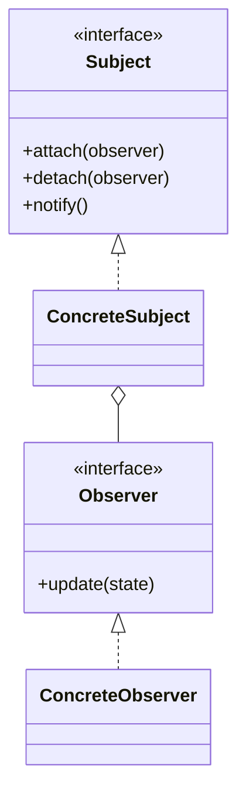

# Software Design Lab Report

## Overview

Use this skill to complete software design pattern lab assignments end to end: implementation, teaching-style UML/Mermaid diagrams, screenshots, report text, and a DOCX using the student’s established coursework style.

This skill pairs well with `school-lab-report-docx` or `documents` when a `.docx` report must preserve a school cover/template.

## Standard Deliverables

For each experiment, produce a self-contained lab folder named after the pattern, for example:

```text
observer-pattern-lab/
├── src/ or server/ public/
├── config/ or database/ when needed
├── diagrams/
│   ├── mermaid/
│   ├── *.puml
│   └── *.png
├── screenshots/
├── report/
│   ├── 实验报告-模式名.md
│   └── generate_docx.py
└── README.md
```

Also generate the final report under `output/doc/`, named like:

```text
软件设计模式实验四-装饰模式.docx
软件设计模式实验五-命令模式.docx
软件设计模式实验-观察者模式.docx
```

## Workflow

1. Read assignment requirements carefully.
   - Identify required pattern roles, required GUI/backend/database features, class diagrams, code snippets, screenshots, and special questions.
   - If the repo has `AGENTS.md`, follow it. Prefer clear teaching diagrams over dependency dumps.

2. Reuse the established school report style.
   - In `/Users/ln1/Projects/Software-design`, use `2023112573-张春冉-期中作业.docx` as the cover/layout reference unless the user specifies another template.
   - Preserve the cover’s run-level formatting: bold labels, underlined values, school logo, spacing, and horizontal rule.
   - Replace only the title and relevant fields.

3. Implement a runnable program.
   - Build the actual required feature, not just text examples.
   - Prefer Java Swing for GUI pattern labs unless the assignment explicitly needs web/frontend/backend.
   - For web labs, use a small local Node/HTML/CSS/JS app when sufficient; include database schema if the assignment mentions MySQL.
   - Keep code simple, readable, and aligned with the pattern’s textbook roles.

4. Generate diagrams.
   - Always include at least two Mermaid sources when applicable:
     - standard pattern structure diagram
     - program main structure diagram
   - Export PNGs with PlantUML when available.
   - Provide Mermaid that can be imported into StarUML/draw.io and hand-adjusted.

5. Generate a screenshot.
   - If a real GUI screenshot is hard in the environment, create a deterministic screenshot generator that accurately represents the running interface.
   - The screenshot must show the assignment’s required features, not a placeholder.

6. Write the report.
   - Sections usually include:
     - pattern summary
     - pattern class diagram example
     - requirements/design
     - program class diagram
     - main code
     - running screenshot
     - special thinking question
     - summary
   - Keep the language like a student report: direct, concrete, not promotional.

7. Verify.
   - Compile/run code.
   - Generate screenshots and diagrams.
   - Generate DOCX.
   - Inspect DOCX paragraphs/images with `python-docx`.
   - Use Quick Look thumbnails (`qlmanage`) when available.
   - Scan for stale content such as old pattern names, old experiment names, “ChatGPT”, “AGENTS”, “自动生成”, “Jmeter”, etc.

## Pattern Implementation Guidelines

Match implementation to the design pattern, not just the feature:

- **Decorator**: each add-on wraps a `Coffee`; show the one-way decorator chain; support removal by rebuilding from the selected add-on list.
- **Command**: each action is a `Command`; undo/redo use command history stacks; button functions are read from XML config.
- **Observer**: a subject keeps observers and notifies on data changes; in web systems, SSE/WebSocket can represent cross-process observer notification.
- **Bridge**: separate abstraction and implementation dimensions; do not create one subclass per combination.
- **DIP**: high-level flow depends on interfaces; avoid format-specific `if-else` in the main service.

## Diagram Rules

Use teaching diagrams:

- Do not include every possible dependency if it makes the diagram tangled.
- Keep arrows semantically correct:
  - implementation points to interface
  - aggregation/composition diamond stays on the owning container
  - bridge/decorator/observer relation should be visible
- For the report, prefer a readable core diagram over a huge complete diagram.
- For user handwork, also provide a Mermaid version with enough structure but not perfect symmetry.

Suggested Mermaid shape:



## DOCX Generation Notes

Use `python-docx` to create reports from the reference `.docx`:

- Load the reference document.
- Replace cover fields by editing existing runs.
- Remove old body content after the cover section.
- Add headings, paragraphs, code blocks, images, and captions.
- Use plain Chinese report phrasing.
- Avoid auto-generated-looking text such as “根据课程作业图示要求” or “AI生成”.

For local reports in `/Users/ln1/Projects/Software-design`, the cover paragraphs are typically:

```text
11 题目：
12 学院：
13 教师：
14 学号姓名：
```

Keep the title in the form:

```text
软件设计模式实验五-命令模式
软件设计模式实验-观察者模式
```

## Validation Checklist

Before final response, confirm:

- Source code compiles or server passes syntax checks.
- Required GUI/frontend/backend/database pieces exist.
- Required config files exist, e.g. XML button mapping or SQL schema.
- Diagram PNGs and Mermaid sources exist.
- Screenshot exists and visibly demonstrates the feature.
- DOCX exists under `output/doc/`.
- DOCX cover matches the reference style.
- No stale names from previous labs remain.
- Any fallback is honestly described, e.g. simulated weather data instead of real API.

Useful checks:

```bash
rg -n "ChatGPT|AGENTS|课程作业|Jmeter|软件测试|创建型模式|桥接模式|装饰模式|命令模式|依赖倒转|自动生成|作为AI|根据课程|扣分" <lab-folder> output/doc/<report>.docx
```

For `.docx`, scan document XML or use `python-docx` because `rg` cannot read Word contents directly.
